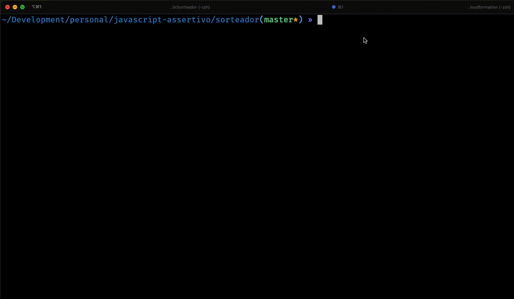

# Sorteador
Essa ferramenta tem o intuito de facilitar dinâmicas de sorteio do livro e tornar as dinâmicas mais simples, claras e divertidas!

Ela funciona gerando um número aleatório em uma determinada lista de participantes.



## Como utilizar
No arquivo [`data/input.json`](./data/input.json) forneça os dados de quem estará participando no sorteio como email, nome, contato, ou qualquer informação.

Após atualizar essa lista, execute o comando:
```sh
npm run sortear <numero>
```

Onde `<numero>` corresponde à quantidade de pessoas que devem ser sorteadas com base na lista preenchida anteriormente. Caso esse parâmetro não seja indicado, somente 1 pessoa será sorteada.

Ao final de sua execução você verá no terminal as pessoas que foram selecionadas aleatoriamente pelo sorteio. Além disso, o arquivo [`data/output.json`](./data/output.json) será atualizado contendo os dados de quem ganhou.

Não se esqueça que tanto a lista de entrada (`input.json`) quanto a de saída (`output.json`) devem permanecer vazias após o processo para evitar divulgar qualquer dado de quem está participando.

## Histórico
Para manter o processo o mais transparente possível, o histórico de sorteios ficará sempre disponível no arquivo [`HISTORY.md`](./HISTORY.md). A ideia é atualizar esse histórico sempre que um novo sorteio ocorre.

As informações mantidas serão:
- evento em que o sorteio foi realizado;
- data de sua realização;
- pessoas sorteadas (somente o primeiro nome).
